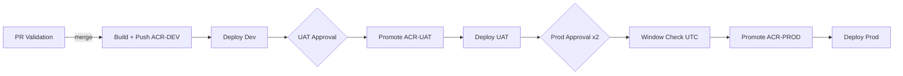

# Azure DevOps CI/CD — Build Once Deploy Many

End-to-end guide for the **Build Once Deploy Many** project on Azure DevOps with three environments (dev, uat, prod) and three dedicated ACRs.

| Item | Value |
|------|-------|
| Organization | [yashjadhav0526](https://dev.azure.com/yashjadhav0526) |
| Project | Build Once Deploy Many |
| Repository remote | `https://dev.azure.com/yashjadhav0526/Build%20Once%20Deploy%20Many/_git/Build%20Once%20Deploy%20Many` |
| Azure resource group | `rg-myapp-cicd` |
| App stack | Python 3.11 / Flask / pytest / Docker |

---

## Repository layout

```
azure-pipelines.yml              # Main multi-stage CI/CD (trigger: develop)
pipelines/
  pr-validation.yml              # PR gate pipeline (trigger: PR → develop)
  templates/
    docker-build.yml             # Build, Trivy scan, push
    acr-promote.yml              # Cross-ACR image promotion
    deploy-aks.yml               # AKS deployment + smoke test
    deploy-appservice.yml        # App Service deployment + smoke test
infra/
  branch-policy.json             # REST API payloads for develop branch policies
  environments.md                # Environment & service connection setup
  variable-groups.md             # Variable groups & Key Vault mapping
  k8s/                           # Kubernetes manifests (USE_AKS=true)
```

---

## Quick start (push to Azure DevOps)

### 1. Provision Azure resources

```bash
az login
RG=rg-myapp-cicd
LOC=centralindia

az group create -n $RG -l $LOC

# Three dedicated ACRs
for ENV in dev uat prod; do
  az acr create -n acr-$ENV -g $RG --sku Basic --admin-enabled false
done

# Optional: App Service apps (USE_AKS=false, default)
az appservice plan create -g $RG -n plan-myapp -l $LOC --is-linux --sku B1
for ENV in dev uat prod; do
  az webapp create -g $RG -p plan-myapp -n yash-python-app-$ENV \
    --deployment-container-image-name "acr-dev.azurecr.io/build-once-deploy-many:latest"
done
```

### 2. Push code to Azure DevOps

```bash
cd "D:\Setoo\Setoo projects\Task1"

git remote remove origin 2>/dev/null || true
git remote add origin "https://dev.azure.com/yashjadhav0526/Build%20Once%20Deploy%20Many/_git/Build%20Once%20Deploy%20Many"

git checkout -b develop 2>/dev/null || git checkout develop
git add azure-pipelines.yml pipelines/ infra/ app.py
git commit -m "Add Azure DevOps multi-environment CI/CD pipelines"
git push -u origin develop
git push origin --all
git push origin --tags
```

### 3. Configure Azure DevOps

1. **Variable groups** — follow [infra/variable-groups.md](infra/variable-groups.md)
2. **Environments** — follow [infra/environments.md](infra/environments.md)
3. **Service connections** — `sc-azure-rm`, `sc-acr-dev`, `sc-acr-uat`, `sc-acr-prod`, optional AKS connections
4. **Pipelines → New pipeline → Azure Repos Git → Existing `azure-pipelines.yml`**
5. **Second pipeline** for `pipelines/pr-validation.yml` (name it `PR Validation`)
6. **Branch policies** on `develop` — apply [infra/branch-policy.json](infra/branch-policy.json) via REST API or Portal UI

### 4. Create supporting branches

```bash
git checkout -b uat develop
git push -u origin uat

git checkout -b main develop
git push -u origin main
```

Branch flow: `feature/*` → PR → `develop` → (pipeline) → dev → approve → uat → approve → prod

---

## Pipeline stages



| Stage | Trigger | Approval | ACR |
|-------|---------|----------|-----|
| PR Validation | PR to `develop` | 1 reviewer + green build | Build only (no push) |
| Build | Push to `develop` | None | Push `acr-dev` |
| Deploy Dev | After build | None | Pull `acr-dev` |
| Promote UAT | After dev | **1 approver** (`uat` env) | Import dev → uat |
| Deploy UAT | After promotion | — | Pull `acr-uat` |
| Promote Prod | After UAT | **2 approvers** (`prod` env) | Import uat → prod |
| Deploy Prod | After promotion | UTC window Mon–Fri 09–18 | Pull `acr-prod` |

---

## Toggle: AKS vs App Service

When running the pipeline manually or editing YAML, set parameter:

| `USE_AKS` | Deployment target |
|-----------|-------------------|
| `false` (default) | Azure App Service (`APP_NAME_DEV/UAT/PROD`) |
| `true` | AKS namespaces (`KUBE_NAMESPACE_DEV/UAT/PROD`) |

---

## Security features

- **Trivy** scans every image before push; build fails on HIGH or CRITICAL CVEs
- **Dedicated SP per ACR** with AcrPush (CI) / AcrPull (deploy) only
- **Prod deployment window** — Mon–Fri 09:00–18:00 UTC (inline script + optional environment check)
- **Immutable tags** — `$(Build.BuildId)` promoted across registries without rebuild

---

## Health endpoint

The app exposes `GET /health` returning HTTP 200. Smoke tests in deploy templates poll this endpoint.

---

## Troubleshooting

| Issue | Fix |
|-------|-----|
| Variable group not authorized | Run pipeline once; click **Permit** on each variable group |
| Docker push 401 | Verify `sc-acr-dev` credentials; SP needs AcrPush |
| `az acr import` fails | Ensure `ACR_SOURCE_USERNAME/PASSWORD` in vg-dev and UAT creds in vg-uat |
| Smoke test timeout | Set `DEV_HEALTH_URL`, `UAT_HEALTH_URL`, `PROD_HEALTH_URL` in variable groups |
| PR comment step skipped | Normal for direct `develop` pushes; runs when `System.PullRequest.PullRequestId` is set |
| Trivy false positives | Pin base image digest or add `.trivyignore` (not included by default) |

---

## Related docs

- [infra/environments.md](infra/environments.md) — Environments, approvers, service connections
- [infra/variable-groups.md](infra/variable-groups.md) — Library variables & Key Vault
- [infra/branch-policy.json](infra/branch-policy.json) — Develop branch policy REST payloads
